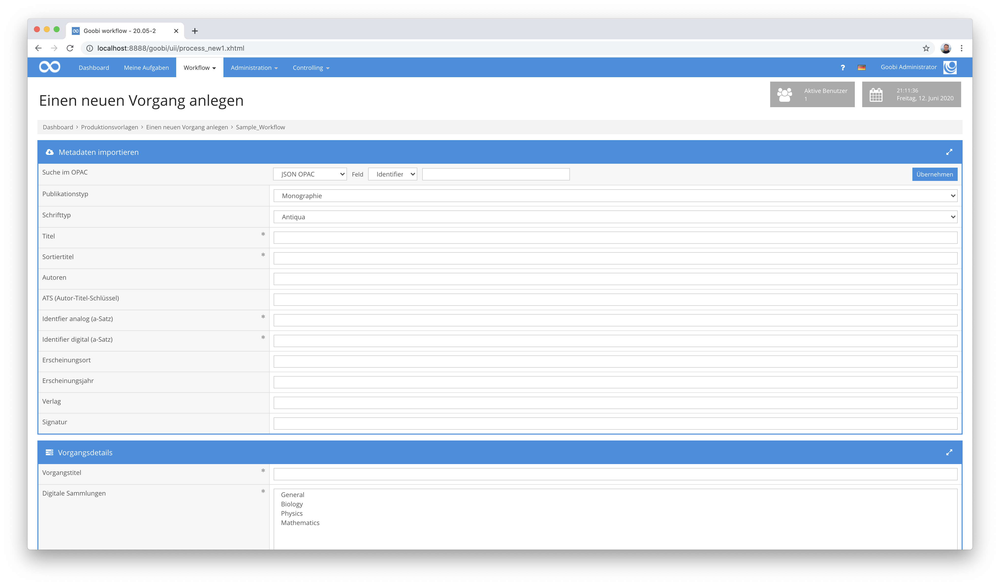
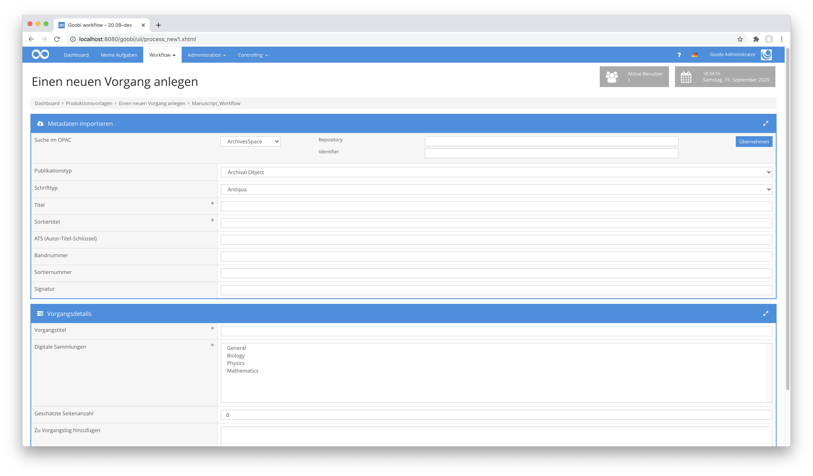
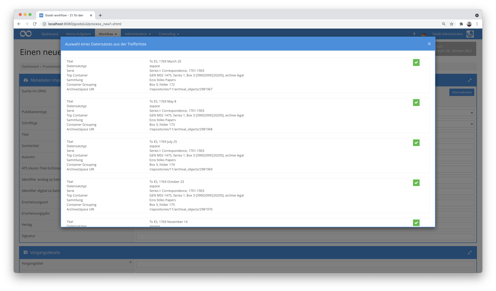

## Einführung
Die vorliegende Dokumentation beschreibt die Installation, Konfiguration und den Einsatz des Plugins. Mit Hilfe dieses Plugins können Daten aus einem externen System abgefragt und in Goobi übernommen werden. Der Katalog muss eine API haben, über die Datensätze als JSON ausgeliefert werden können.


## Installation
Das Plugin besteht aus drei Dateien:

```bash
plugin_intranda_opac_json-base.jar
plugin_intranda_opac_json-gui.jar
plugin_intranda_opac_json.xml
```

Die Datei `plugin_intranda_opac_json-base.jar` enthält die Programmlogik und muss für den Nutzer `tomcat8` lesbar an folgendem Pfad installiert werden:

```bash
/opt/digiverso/goobi/plugins/opac/plugin_intranda_opac_json-base.jar
```

Die Datei `plugin_intranda_opac_json-gui.jar` enthält die Nutzeroberfläche und muss für den Nutzer `tomcat8` lesbar an folgendem Pfad installiert werden:

```bash
/opt/digiverso/goobi/plugins/GUI/plugin_intranda_opac_json-gui.jar
```

Die Datei `plugin_intranda_opac_json.xml` muss ebenfalls für den Nutzer `tomcat8` lesbar sein und unter folgendem Pfad liegen:

```bash
/opt/digiverso/goobi/config/plugin_intranda_opac_json.xml
```


## Überblick und Funktionsweise
Wenn in Goobi nach einem Identifier gesucht wird, wird im Hintergrund eine Anfrage an die konfigurierte URL gestellt.



Passend zur oben beschriebenen Konfiguration entspricht dies etwa der folgenden URL:

```bash
https://example.com/opac?id=[IDENTIFIER]
```

Sind weitere Felder für die Katalogabfrage definiert, so werden diese ebenfalls in der Nutzeroberfläche angezeigt:



Sofern unter dieser URL ein gültiger Datensatz gefunden wird, wird dieser nach den innerhalb von `recordType` definierten Feldern durchsucht, in dem der Dokumententyp stehen soll. Wenn keine Felder definiert wurden oder sie nicht gefunden wurden, wird stattdessen der Typ aus dem konfigurierten Element `defaultPublicationType` genutzt. Mit dem ermittelten Typ wird dann das gewünschte Strukturelement erzeugt.

Im Anschluß daran werden die konfigurierten Ausdrücke der `metadata` und `person` der Reihe nach ausgewertet. Sofern mit einem Ausdruck Daten gefunden werden, wird das entsprechend angegebene Metadatum erzeugt.

Wurde innerhalb der Konfiguration mit dem Parameter `showResultList` festgelegt, dass eine Trefferliste zur Verfügung stehen soll, aus der der Nutzer einen Datensatz auswählen kann, so öffnet sich nach der Katalogabfrage ein Dialog wie der folgende:




## Konfiguration
Die Konfiguration des Plugins erfolgt in den folgenden Dateien, die sich im Verzeichnis `/opt/digiverso/goobi/config/` befinden.

```bash
goobi_opac.xml
plugin_intranda_opac_json.xml
```

In der Datei `goobi_opac.xml` muss die Schnittstelle zum gewünschten Katalogsystem bekannt gemacht werden. Dies geschieht durch einen Eintrag, der wie folgt aussieht:

```xml
<catalogue title="JSON">
    <config description="JSON OPAC" address="x"
    port="443" database="x" iktlist="x" ucnf="x" opacType="intranda_opac_json" />
</catalogue>
```

Das Attribut `title` enthält einen eindeutigen Namen. Das zu verwendende Plugin wird durch `opacType` bestimmt, das in diesem Fall `intranda_opac_json` sein muss. Die anderen Felder sind nicht erforderlich.

Die Zuordnung des JSON-Datensatzes zu den Goobi-Metadaten wird durch die Datei `plugin_intranda_opac_json.xml` bestimmt. Auf die Felder innerhalb des JSON-Datensatzes wird mit `JSONPath`, dem XPath-Äquivalent für JSON, verwiesen.

```xml
<config_plugin>
    <config name="Opac Name">

        <showResultList>true</showResultList>
        <urlForSecondCall>https://example.goobi.io/metadatacloud/api</urlForSecondCall>

        <field id="repository">
            <label>Repository</label>
            <select>1</select>
            <select>2</select>
            <select>3</select>
            <type>select</type>
            <defaultText>1</defaultText>
            <url></url>
        </field>

        <field id="id">
            <label>Identifier</label>
            <type>text</type>
            <defaultText></defaultText>
            <url></url>
        </field>

        <field id="type">
            <label></label>
            <type>select+text</type>
            <select>barcode</select>
            <select>holding</select>
            <select>item</select>
            <defaultText></defaultText>
            <url>https://example.com/repository/{repository.select}/}{type.select}/{type.text}?id={id.text}</url>
        </field>

        <authentication>
            <username>user</username>
            <password>password</password>
        </authentication>

        <defaultPublicationType>Monograph</defaultPublicationType>

        <metadata metadata="PublicationYear" field="$.date" />
        <metadata metadata="DocLanguage" field="$.language" />
        <metadata metadata="CatalogIDDigital" field="$.identifier" docType="volume" />
        <metadata metadata="CatalogIDDigital" field="$.children[?(@.itemCount > 1)].children[0].itemId" docType="volume" />
        <metadata metadata="CatalogIDDigital" field="$.uri" regularExpression="s/\/some-prefix\/(.+)/$1/g" docType="anchor" />
        <metadata metadata="shelfmarksource" field="$.identifierShelfMark" docType="volume" />
        <metadata metadata="TitleDocMain" field="$.title" docType="volume" />
        <metadata metadata="OtherTitle" field="$.alternativeTitle" docType="volume" />
        <metadata metadata="CurrentNo" field="$..children[0].children[0].sequenceNumber" docType="volume" />
        <metadata metadata="CurrentNoSorting" field="$..children[0].children[0].sequenceNumber" docType="volume" />

        <person metadata="Author" field="creator" firstname="s/^(.+?)\, (.+?)$/$2/g" lastname="s/^(.+?)\, (.+?)$/$1/g" validationExpression="/^.+?\, .+?\, .+$/" regularExpression="s/^(.+?)\, (.+?)\, .+/$1\, $2/g"/>
    </config>

    <config>
        <field id="id">
            <label>Identifier</label>
            <type>text</type>
            <defaultText></defaultText>
            <url>http://example.com/repositories/2/archival_objects/{id.text}</url>
        </field>
        <authentication>
            <username>user</username>
            <password>password</password>
            <loginUrl>http://example.com/users/{username}/login</loginUrl>
            <sessionid>session</sessionid>
            <headerParameter>Token</headerParameter>
        </authentication>
        <recordType field="[?(@.jsonmodel_type=='archival_object')]" docType="ArchivalObject" />
        <metadata metadata="TitleDocMain" field="$.title" />

        <metadata metadata="PublicationStart" field="$.dates.begin" />
        <metadata metadata="PublicationEnd" field="$.dates.end" />
        <metadata metadata="PublicationRun" field="$.dates.expression" />
        <person metadata="Author" field="$.linked_agents[?(@.role=='creator')].ref" followLink="true" templateName="Person" basisUrl="http://example.com"/>
        <metadata metadata="DocLanguage" field="$.notes[?(@.type=='langmaterial')].content[*]" />
        <metadata metadata="Note" field="$.notes[?(@.label=='Writing')].subnotes[*].content" />
        <metadata metadata="Illustration" field="$.notes[?(@.label=='Illumination')].subnotes[*].content" />
        <metadata metadata="Provenience" field="$.notes[?(@.type=='custodhist')].subnotes[*].content" />
        <metadata metadata="CatalogIDDigital" field="$.uri" regularExpression="s/.*\/(.+)$/$1/" />
    </config>

    <config>
        <template>Person</template>
        <person metadata="Author" field="$.title" firstname="s/^(.*?)\,(.*?)\,.*/$2/g" lastname="s/^(.*?)\,(.*?)\,.*$/$1/g" identifier="$.uri"/>
    </config>
</config_plugin>
```

Die zur Verfügung stehenden Kataloge werden in einzelnen `<config name="XYZ">` Blöcken definiert. Das Attribut `name` enthält den Namen, unter den der Katalog ausgewählt werden kann.

Innerhalb des Katalogs können verschiedene Feldtypen genutzt werden:

| Feldtyp | Beschreibung |
| :--- | :--- |
| `field` | Mit dieser Konfiguration können weitere Abfragefelder definiert werden, die innerhalb der Nutzeroberfläche aufgeführt werden sollen. |
| `authentication` | Geben Sie hier die Zugangsdaten für den Zugriff auf die Katalogschnittstelle an. |
| `recordType` | Dieser Typ dient zum Erkennen des Dokumententyps des JSON-Datensatzes. |
| `defaultPublicationType` | Dieser Typ wird genutzt, wenn zuvor kein Dokumententyp erkannt wurde. |
| `metadata` | Dieser Typ dient zum Mapping von JSON-Feldern zu Metadaten. |
| `person` | Dieser Typ dient zum Mapping von JSON-Feldern zu Personen. |
| `showResultList` | Mit diesem Parameter kann festgelegt werden, dass nach einer Katalogabfrage eine Auswahlliste angezeigt werden soll, die eine Auswahl des zu importierenden Unterdatensatzes aus einer Liste erlaubt. |
| `urlForSecondCall` | Die hier angebene URL wird dazu verwendet, dass die ID des ausgewählten Unterdatensatzes für die Abfrage an die hier festgelegte URL angehängt wird. |


### Feldtyp: field
Das Element `<field>` wird über das Attribut `id` identifiziert. Innerhalb der Einträge kann im Element `<type>` definiert werden, welche Felder in der Eingabemaske zur Verfügung stehen. Dabei gibt es die verschiedenen Typen `text`, `select` und `select+text`. Der Type `text` erzeugt ein einfaches Eingabefeld, `select` eine Auswahlliste und `select+text` beides. Das Element `<label>` enthält den Namen, unter dem das Feld in der Oberfläche angezeigt wird und die Einträge in `<select>` defininieren, welche Inhalte in der Auswahlliste enthalten sind. Optional lässt sich eine Vorbelegung angeben. Dies geschieht mit dem Element `<defaultText>`.

Das Element ist wiederholbar, so dass die Eingabemaske auch mehrere Eingabefelder enthalten kann.

Eines der Felder muss dabei die URL zum Katalog enthalten. Dieser wird innerhalb des Elements `<url>` definiert. Um auf die Nutzereingaben zugreifen zu können, stehen die Variablen `{id.select}` und `{id.text}` zur Verfügung, wobei `id` durch den gewünschten field-Identifier ersetzt werden muss.


### Feldtyp: authentication
Mittels `<authentication>` kann definiert werden, wie die Authentifizierung gegenüber dem Katalog erfolgen soll. Das Element kann fehlen oder frei bleiben, wenn der Katalog anonyme Zugriffe erlaubt.

Ansonsten stehen zwei Arten zur Verfügung. Sind nur `<username>` und `<password>` angegeben, findet eine Basic-Authentifizierung statt.

Als zweite Möglichkeit steht ein Login zur Verfügung. Hierbei wird die im Feld `<loginUrl>` definierte API aufgerufen, um eine gültige Session-ID zu bekommen. Dabei wird die Session-ID in dem Feld gesucht, das in `<sessionid>` konfiguriert wird. Die Session-ID wird dann beim eigentlichen Request als Header-Parameter genutzt. Der Parameter wird in `<headerParameter>` festgelegt.


### Feldtyp: recordType
Das Element `<recordType>` enthält die Attribute `field`, `docType` und `anchorType`. In `field` wird ein JSONPath-Ausdruck angegeben, der auf den Datensatz angewendet wird. Falls es sich bei dem Typ um ein mehrbändiges Werk oder eine Zeitung/Zeitschrift handelt, muss der zu nutzende `anchor` Typ im Feld `anchorType` angegeben werden. Existiert ein Feld mit so einem Ausdruck, wird der in `docType` definierte Dokumententyp erstellt. Wenn nicht, wird der nächste konfigurierte `recordType` überprüft.

Dabei gibt es eine Reihe von Zeichen, die in dieser Datei maskiert sind. Das betrifft zum einen Zeichen wie `< > & "`, die in XML eine besondere Bedeutung haben und daher als `&lt; &gt; &amp; &quot;` angegeben werden müssen. Daneben ist noch das `Komma` betroffen, das mittels Backslash ebenfalls als `\,` maskiert werden muss.


### Feldtyp: defaultPublicationType
Wenn keine der Definitionen zutreffen, kann ein Dokument mit dem Typ aus `<defaultPublicationType>` erzeugt werden. Wenn dieses Feld fehlt oder leer ist, wird stattdessen kein Datensatz angelegt.


### Feldtypen: metadata & person
Die beiden Element `<metadata>` und `<person>` dienen zum Import einzelner Inhalte aus dem JSON-Datensatz in in die jeweiligen Metadaten. Dazu stehen eine Reihe von Attributen zur Verfügung:

| Attribut | Bedeutung |
| :--- | :--- |
| `metadata` | Enthält den Namen des Metadatums oder der Person |
| `field` | Pfad zum Inhalt innerhalb des JSON-Objekts |
| `docType` | Darf den Wert `anchor` oder `volume` haben. Der default-Wert ist `volume`. Mit `anchor` gekennzeichnete Felder werden nur bei Mehrbändigen Werken überprüft und importiert. |
| `validationExpression` | Regulärer Ausdruck, der prüft ob der gefundene Wert dem definierten Ausdruck entspricht. Ist dies nicht der Fall, wird der Wert ignoriert. |
| `regularExpression` | Ein regulärer Ausdruck zur Manipulation des Wertes. Dieser wird nach der Prüfung der `validationExpression` angewendet. |
| `firstname` | Ein regulärer Ausdruck, mit dem bei Personen der Vorname aus dem Feldinhalt ermittelt wird. |
| `lastname` | Ein regulärer Ausdruck, mit dem bei Personen der Nachname aus dem Feldinhalt ermittelt wird. |
| `followLink` | Definiert, ob der enthaltene Wert direkt importiert wird, oder einen Link zu einem anderen Datensatz enthält. |
| `templateName` | Enthält den Namen des zu nutzenden `<config>` Blocks, mit dem der neue Datensatz analysiert werden soll. |
| `basisUrl` | Enthält die zu nutzende Basis-URL, falls der Link zum Datensatz ein relativer Pfad ist. |


## Nützliche Links
Für die Installation bzw. insbesondere für die Konfiguration des Plugins könnten die folgenden URLs eine weiterführende Hilfe sein:

JSONPath Online Evaluator: [https://jsonpath.com/](https://jsonpath.com/)

JSONPath Description: [https://support.smartbear.com/alertsite/docs/monitors/api/endpoint/jsonpath.html](https://support.smartbear.com/alertsite/docs/monitors/api/endpoint/jsonpath.html)
