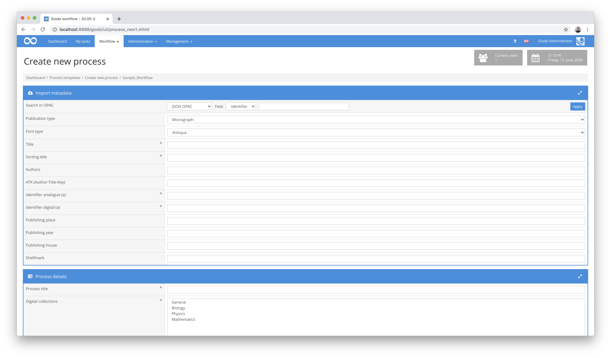
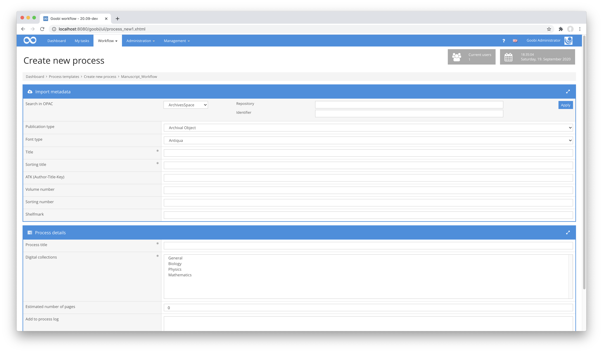
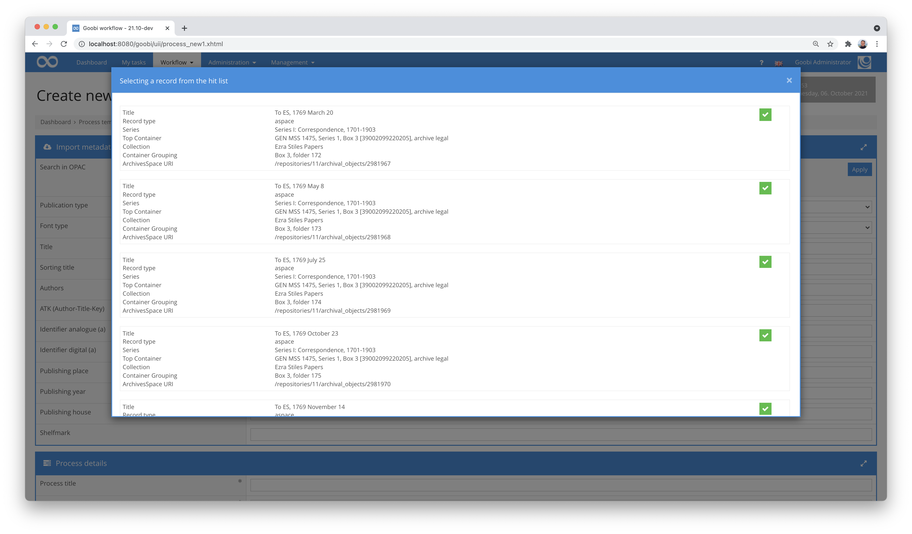

## Introduction
This documentation describes the installation, configuration and use of the plugin. You can use this plugin to retrieve data from an external system and transfer it to Goobi. The catalog must have an API that allows records to be delivered as JSON.


## Installation
The plugin consists of three files:

```bash
plugin_intranda_opac_json-base.jar
plugin_intranda_opac_json-gui.jar
plugin_intranda_opac_json.xml
```

The file `plugin_intranda_opac_json-base.jar` contains the program logic and must be installed readable for the user `tomcat8` at the following path:

```bash
/opt/digiverso/goobi/plugins/opac/plugin_intranda_opac_json-base.jar
```

The file `plugin_intranda_opac_json-gui.jar` contains the user interface and must be installed readable for the user `tomcat8` at the following path:

```bash
/opt/digiverso/goobi/plugins/GUI/plugin_intranda_opac_json-gui.jar
```

The file `plugin_intranda_opac_json.xml` must also be readable by the user `tomcat8` and must be located under the following path:

```bash
/opt/digiverso/goobi/config/plugin_intranda_opac_json.xml
```


## Overview and functionality
When you search for an identifier in Goobi, a request is sent to the configured URL in the background.



According to the configuration described above, this corresponds approximately to the following URL:

```bash
https://example.com/opac?id=[IDENTIFIER]
```

If further fields are defined for the catalogue query, these are also displayed in the user interface:



If a valid record is found under this URL, it will be searched for the fields defined within `recordType` in which the document type should be located. If no fields are defined or they are not found, the type from the configured element `defaultPublicationType` is used instead. The required structure element is then created with the determined type.

The configured expressions of the `metadata` and `person` are then evaluated in sequence. If data is found with an expression, the corresponding specified metadata is generated.




## Configuration
The configuration of the plugin is done in the following files located in the directory `/opt/digiverso/goobi/config/`.

```bash
goobi_opac.xml
plugin_intranda_opac_json.xml
```

In the file `goobi_opac.xml` the interface to the desired catalog system must be made known. This is done with an entry that looks like the following:

```xml
<catalogue title="JSON">
    <config description="JSON OPAC" address="x"
    port="443" database="x" iktlist="x" ucnf="x" opacType="intranda_opac_json" />
</catalogue>
```

The attribute `title` contains a unique name and `opacType` the plugin to be used. In this case the entry must be `intranda_opac_json`. The other fields are not required.

The mapping of the contents of the JSON dataset to Goobi metadata is done within the file `plugin_intranda_opac_json.xml`. The definition of the fields within the JSON record is done using `JSONPath`, the XPath equivalent for JSON.

```xml
<config_plugin>
    <config name="Opac Name">

        <showResultList>true</showResultList>
        <urlForSecondCall>https://example.goobi.io/metadatacloud/api</urlForSecondCall>

        <field id="repository">
            <label>Repository</label>
            <select>1</select>
            <select>2</select>
            <select>3</select>
            <type>select</type>
            <defaultText>1</defaultText>
            <url></url>
        </field>

        <field id="id">
            <label>Identifier</label>
            <type>text</type>
            <defaultText></defaultText>
            <url></url>
        </field>

        <field id="type">
            <label></label>
            <type>select+text</type>
            <select>barcode</select>
            <select>holding</select>
            <select>item</select>
            <defaultText></defaultText>
            <url>https://example.com/repository/{repository.select}/}{type.select}/{type.text}?id={id.text}</url>
        </field>

        <authentication>
            <username>user</username>
            <password>password</password>
        </authentication>

        <defaultPublicationType>Monograph</defaultPublicationType>

        <metadata metadata="PublicationYear" field="$.date" />
        <metadata metadata="DocLanguage" field="$.language" />
        <metadata metadata="CatalogIDDigital" field="$.identifier" docType="volume" />
        <metadata metadata="CatalogIDDigital" field="$.children[?(@.itemCount > 1)].children[0].itemId" docType="volume" />
        <metadata metadata="CatalogIDDigital" field="$.uri" regularExpression="s/\/some-prefix\/(.+)/$1/g" docType="anchor" />
        <metadata metadata="shelfmarksource" field="$.identifierShelfMark" docType="volume" />
        <metadata metadata="TitleDocMain" field="$.title" docType="volume" />
        <metadata metadata="OtherTitle" field="$.alternativeTitle" docType="volume" />
        <metadata metadata="CurrentNo" field="$..children[0].children[0].sequenceNumber" docType="volume" />
        <metadata metadata="CurrentNoSorting" field="$..children[0].children[0].sequenceNumber" docType="volume" />

        <person metadata="Author" field="creator" firstname="s/^(.+?)\, (.+?)$/$2/g" lastname="s/^(.+?)\, (.+?)$/$1/g" validationExpression="/^.+?\, .+?\, .+$/" regularExpression="s/^(.+?)\, (.+?)\, .+/$1\, $2/g"/>
    </config>

    <config>
        <field id="id">
            <label>Identifier</label>
            <type>text</type>
            <defaultText></defaultText>
            <url>http://example.com/repositories/2/archival_objects/{id.text}</url>
        </field>
        <authentication>
            <username>user</username>
            <password>password</password>
            <loginUrl>http://example.com/users/{username}/login</loginUrl>
            <sessionid>session</sessionid>
            <headerParameter>Token</headerParameter>
        </authentication>
        <recordType field="[?(@.jsonmodel_type=='archival_object')]" docType="ArchivalObject" />
        <metadata metadata="TitleDocMain" field="$.title" />

        <metadata metadata="PublicationStart" field="$.dates.begin" />
        <metadata metadata="PublicationEnd" field="$.dates.end" />
        <metadata metadata="PublicationRun" field="$.dates.expression" />
        <person metadata="Author" field="$.linked_agents[?(@.role=='creator')].ref" followLink="true" templateName="Person" basisUrl="http://example.com"/>
        <metadata metadata="DocLanguage" field="$.notes[?(@.type=='langmaterial')].content[*]" />
        <metadata metadata="Note" field="$.notes[?(@.label=='Writing')].subnotes[*].content" />
        <metadata metadata="Illustration" field="$.notes[?(@.label=='Illumination')].subnotes[*].content" />
        <metadata metadata="Provenience" field="$.notes[?(@.type=='custodhist')].subnotes[*].content" />
        <metadata metadata="CatalogIDDigital" field="$.uri" regularExpression="s/.*\/(.+)$/$1/" />
    </config>

    <config>
        <template>Person</template>
        <person metadata="Author" field="$.title" firstname="s/^(.*?)\,(.*?)\,.*/$2/g" lastname="s/^(.*?)\,(.*?)\,.*$/$1/g" identifier="$.uri"/>
    </config>
</config_plugin>
```

The available catalogues are defined in individual `<config name="XYZ">` blocks. The attribute `name` contains the name under which the catalogue can be selected.

Different field types can be used within the catalogue:

| Field type | Description |
| :--- | :--- |
| `field` | This configuration can be used to define additional query fields to be listed within the user interface. |
| `authentication` | Enter the access data for accessing the catalogue interface here. |
| `recordType` | This type is used to detect the document type of the JSON record. |
| `defaultPublicationType` | This type is used when no document type has been detected before. |
| `metadata` | This type is used to map JSON fields to metadata. |
| `person` | This type is used to map JSON fields to persons. |
| `showResultList` | This parameter can be used to specify that a selection list should be displayed after a catalogue query, allowing selection of the subrecord to be imported from a list. |
| `urlForSecondCall` | The URL specified here is used to have the ID of the selected sub-record for the query appended to the URL specified here. |


### Field type: field
The element `<field>` is identified by the attribute `id`. Within the entries, the element `<type>` can be used to define which fields are available in the input mask. There are the different types `text`, `select` and `select+text`. The type `text` creates a simple input field, `select` a selection list and `select+text` both. The element `<label>` contains the name under which the field is displayed in the interface and the entries in `<select>` define which contents are contained in the selection list. Optionally, a default value can be specified. This is done with the element `<defaultText>`.

The element is repeatable, so that the input mask can also contain several input fields.

One of the fields must contain the URL to the catalogue. This is defined within the element `<url>`. To access the user input, the variables `{id.select}` and `{id.text}` are available, whereby `id` must be replaced by the desired field identifier.


### Field type: authentication
By means of `<authentication>` it can be defined how the authentication towards the catalogue is to take place. The element can be missing or remain free if the catalogue allows anonymous access.

Otherwise two types are available. If only `<username>` and `<password>` are specified, a basic authentication takes place.

The second possibility is a login. Here the API defined in the field `<loginUrl>` is called to get a valid session ID. Here the session ID is searched for in the field that is configured in `<sessionid>`. The session ID is then used as a header parameter for the actual request. The parameter is set in `<headerParameter>`.


### Field type: recordType
The element `<recordType>` contains the attributes `field`, `docType` and `anchorType`. In `field` a JSONPath expression is specified that is applied to the record. If the type is a multi-volume work or newspaper/magazine, the `anchor` type to be used must be specified in the `anchorType` field. If a field with such an expression exists, the document type defined in `docType` is created. If not, the next configured `recordType` will be checked.

There are a number of characters that are masked in this file. This includes characters such as `< > & "`, which have a special meaning in XML and must therefore be specified as `&lt; &gt; &amp; &quot;`. Also affected is the `comma`, which must also be masked as `\,` using a backslash.


### Field type: defaultPublicationType
If none of the definitions apply, a document can be created with the type from `<defaultPublicationType>`. If this field is missing or empty, no record is created instead.


### Field types: metadata & person
The two fields `<metadata>` and `<person>` are used to import individual content from the JSON record into the respective metadata. A number of attributes are available for this purpose:

| Attribute | Meaning |
| :--- | :--- |
| `metadata` | Contains the name of the metadata or person |
| `field` | Path to the content within the JSON object |
| `docType` | May have the value `anchor` or `volume`. The default value is `volume`. Fields marked with `anchor` are only checked and imported for multi-volume works. |
| `validationExpression` | Regular expression, which checks if the found value matches the defined expression. If this is not the case, the value is ignored. |
| `regularExpression` | A regular expression to manipulate the value. This is applied after the `validationExpression` check. |
| `firstname` | A regular expression that determines the first name of a person from the field contents. |
| `lastname` | A regular expression that determines the last name of a person from the field contents. |
| `followLink` | Defines whether the contained value is imported directly or contains a link to another data record. |
| `templateName` | Contains the name of the `<config>` block to be used to analyse the new record. |
| `basisUrl` | Contains the base URL to be used if the link to the record is a relative path. |


## Useful links
The following URLs could be of further help for the installation or especially for the configuration of the plugin:

JSONPath Online Evaluator: [https://jsonpath.com/](https://jsonpath.com/)

JSONPath Description: [https://support.smartbear.com/alertsite/docs/monitors/api/endpoint/jsonpath.html](https://support.smartbear.com/alertsite/docs/monitors/api/endpoint/jsonpath.html)
